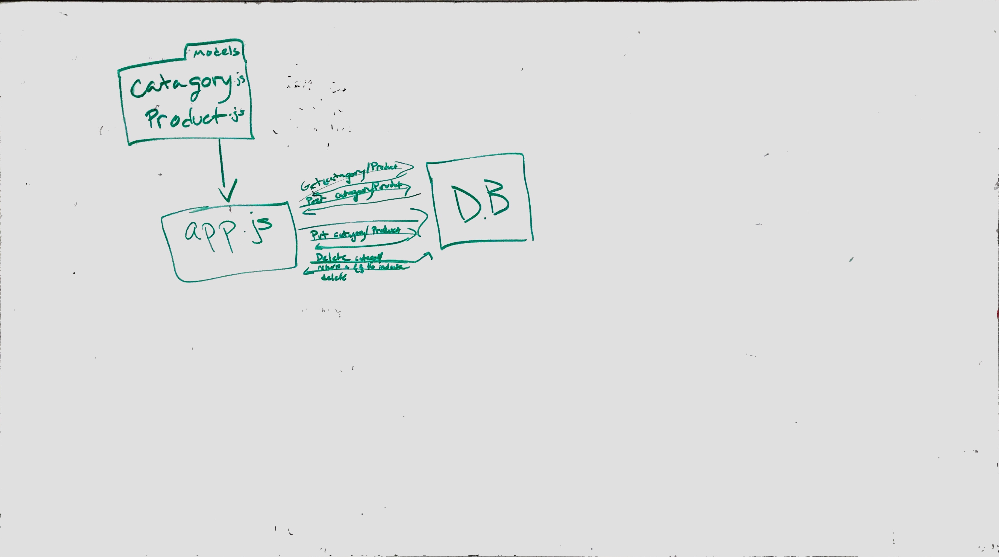

# LAB - 08

## Express Routing & Connected API

### Author: Joseph Hangarter & most of the class

### Links and Resources
* [submission PR](https://github.com/401-advanced-javascriptnights-joseph/lab-08-Express-Routing---Connected-API/pull/2)
* [travis]()

#### Documentation

### Modules
#### `index.js` - starts server connects to mongo
#### `app.js` - routes
#### `mongo.js` - class Model with CRUD method
#### `404.js` - middleware function 404 error
#### `error.js` - middleware function 500 error
#### `categories.js` - extends from Model with schema in constructor
#### `categories-schema.js` - schema
#### `categories.test.js` - test for ``categories.js`
#### `products.js` - extends from Model with schema in constructor
#### `products.schema.js` - schema
#### `products.test.js` - test for `products.js`
#### `app.test.js` - test for `app.js`
#### `supergoose.js` - Combines SuperTest and Mongoose Memory Server; 

##### Exported Values and Methods
CRUD method

### Setup
#### `.env` requirements
* `PORT` - Port Number
* `MONGODB_URI` - URL to the running mongo instance/db

#### Running the app
* `node index.js`
* `mongo on a second terminal`
  
#### Tests
* `npm test`

#### UML

